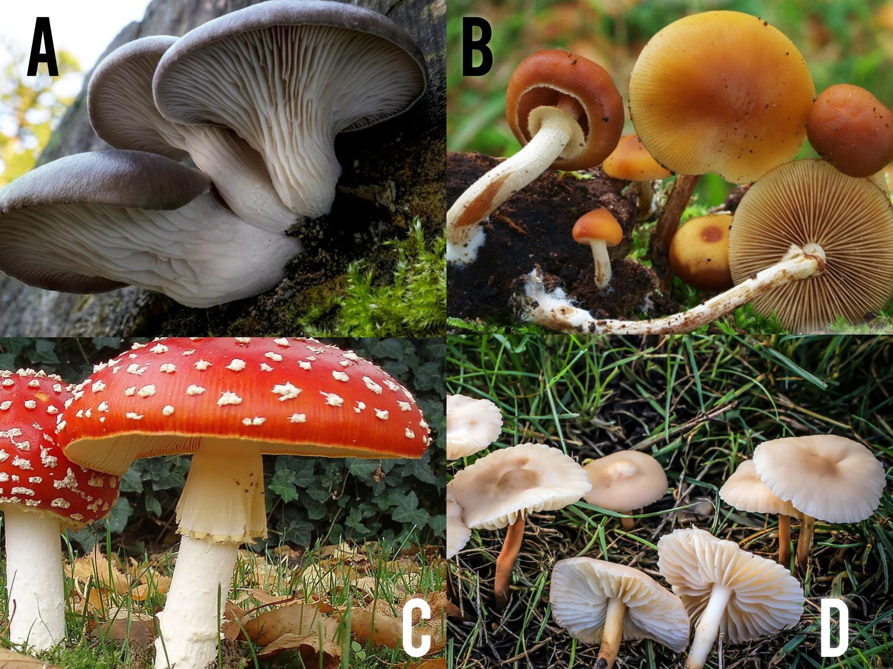

##  [#30DayChartChallenge](https://twitter.com/hashtag/30DayChartChallenge?src=hashtag_click)

I share my journey in the 30 Day Chart Challenge.

### Follow me: [@melisadigiacomo](https://twitter.com/melisadigiacomo)  

 
## Skills and resources  

 
 

## How I participated in the challenge
I challenged myself to use a different dataset each day and a variety of tools to build charts.
I always gave credit to data source and inspiration. 

## All my contributions

## Day by day challenge

| Day       | Category              | Chart                                            | Language/Resource     |
| --------- | --------------------- | ------------------------------------------------ | --------------------- |
| [01](#01) | Comparisons           | Part-to-whole                                    | R                     |  
| [02](#02) | Comparisons           | Pictogram                                        | Canva                 |  
| [03](#03) | Comparisons           | Historical                                       | R                     |  
| [04](#04) | Comparisons           | Flora                                            | Python                |  
| [05](#05) | Comparisons           | Slope                                            | Microsoft Power BI    |  
| [06](#06) | Comparisons           | Data day: OWID                                   | Google Data Studio    |  
| [07](#07) | Distributions         | Physical                                         | R                     |  
| [08](#08) | Distributions         | Mountains                                        | R                     |  
| [09](#09) | Distributions         | Statistics                                       | R                     |  
| [10](#10) | Distributions         | Experimental                                     | Microsoft Power BI    |  
| [11](#11) | Distributions         | Circular                                         | R                     |  
| [12](#12) | Distributions         | Theme day: The Economist                         | R                     |  
| [13](#13) | Relationships         | Correlation                                      | R                     |  
| [14](#14) | Relationships         | 3-dimensional                                    | Microsoft Power Point |  
| [15](#15) | Relationships         | Multivariate                                     | R                     |  
| [16](#16) | Relationships         | Environment                                      | R                     |  
| [17](#17) | Relationships         | Connections                                      | Microsoft Power BI    |  
| [18](#18) | Relationships         | Data day: OECD                                   | R                     |  
| [19](#19) | Timeseries            | Global change                                    | R                     |  
| [20](#20) | Timeseries            | New tool                                         | RAW Graphs            |  
| [21](#21) | Timeseries            | Down-upwards                                     | plotly in Python      |  
| [22](#22) | Timeseries            | Animation                                        | Microsoft Power BI    |  
| [23](#23) | Timeseries            | Tiles                                            | Microsoft Power BI    |  
| [24](#24) | Timeseries            | Theme day: Financial Times                       | R                     |  
| [25](#25) | Uncertainties         | Trend                                            | R                     |  
| [26](#26) | Uncertainties         | Interactive                                      | Microsoft Power BI    |  
| [27](#27) | Uncertainties         | Future                                           | R                     |  
| [28](#28) | Uncertainties         | Deviations                                       | R                     |  
| [29](#29) | Uncertainties         | Storytelling                                     | R                     |  
| [30](#30) | Uncertainties         | Theme day: UNPopulation                          | R                     |  

# #30DayChartChallenge  

# **Comparisons**

## [**Day 01: part-to-whole**](./DAY01_part-to-whole) 

I learned to use {ggparliament}.
I analyzed the top 1000 Instagram influencers. Here are the most common categories.  
[Code](./DAY01_part-to-whole/influencers.R)

  

## [**Day 02: pictogram**](./DAY02_pictogram) 

Schematic representation of the percentage of women awarded Chemistry Nobel Prize between 1901 and 2021.  

 

A big pleasure to be retweeted by [@CedScherer](https://twitter.com/CedScherer), a person I admire a lot!  

 

## [**Day 03: historical**](./DAY03_historical) 

Independence day of South American countries. A #TidyTuesday dataset! 
I combined geom_segment and geom_point to build the plot. I finished it with Canva.  
[Code](./DAY03_historical/independence.R)

  

## [**Day 04: flora**](./DAY04_flora) 

I analyzed the 10 most common trees of Buenos Aires parks. Eucalipto was the most frequent. Jacarandá was the third and my favourite.
I built it using matplotlib in Python.
I always finish my charts and make them prettier using Canva. I want to learn Figma in order to do this.  
[Code](https://github.com/melisadigiacomo/DataAnalysis_BuenosAiresTrees/blob/master/arbolado_parques_veredas.py)

 

I was so excited for the [@matplotlib](https://twitter.com/matplotlib) like!

 

## [**Day 05: slope**](./DAY05_slope) 

BEE colonies 🐝
I've always been fascinating by bees life so I dived into colonies dataset.  
The plot shows the net gain and net loss by year in USA.
I built it using Microsoft Power BI.

 

## [**Day 06: data day: OWID**](./DAY06_OWID) 

I brought a heatmap of tomato yields in 2018 built with Google Data Studio.
European countries displayed the highest yields, some of them reached over 300 tonnes per hectare 🍅🍅
Data was scraped from #OWID (source: FAO).

   

# **Distributions**

## [**Day 07: physical**](./DAY07_physical) 

The most famous sport competition around the world: The Olympic Games
I analyzed weight and height of athletes from Atenas 1896 to Rio 2016.
I found this dataset in #kaggle, from [sports-reference.com](http://sports-reference.com) via Randin Griffin.  
[Code](./DAY07_physical/olympics.R)

 

## [**Day 08: mountains**](./DAY08_mountains) 

Mountains of sweetness and acidity in different tomato botanical varieties.  
🍅 BIG FLAVOR COMES IN SMALL PACKAGE 🍅  
Source: Table S1, Tieman et al. (2017)  
I used {geomtextpath} R package for the first time, easy and pretty for labeling!  
[Code](./DAY08_mountains/densityplot_geomtextpath.R)

 

## [**Day 09: statistics**](./DAY09_statistics) 

Violin plot of coffee aroma ☕️  
There is a statistically significant difference (Kruskal-Wallis test,  H =52.654 p-value=1.007e-10). Letters based on non-parametric multiple comparisons show which groups are different (α=5%).  
[Code](./DAY09_statistics/coffee_violin.R)

  

## [**Day 10: experimental**](./DAY10_experimental) 

First time experimenting Twitter Analytics. I decided to dive into my metrics since I started this challenge. Little steps in a big journey of #dataviz

  

## [**Day 11: circular**](./DAY11_circular) 

How not to die eating mushrooms in the forest, some poisonous alerts.
Do you wanna try your chances? Take the little quiz below.  
[Code](./DAY11_circular/circle_mushrooms.R)

  

Would you live or die? Could you guess poisonous or edible by the pictures? Tomorrow I will give names and your chances survive.

  

## [**Day 12: theme day: The Economist**](./DAY12_TheEconomist) 

I emulated The Economist type of visualizations using theme_economist() of {ggthemes} and some styling in Canva.
The chart shows the most viewed TED talks.  
[Code](./DAY12_TheEconomist/the_economist.R)

  

# **Relationships**

## [**Day 13: correlation**](./DAY13_correlation) 

More coffee data! ☕️ This time, Starbucks coffee correlations!  
Overview of drink components correlations visualized in a color correlation matrix. Pearsons correlation coefficients are displayed. P-value was set at 0.05 and correlations that were not significant are shown with x marks.  
[Code](./DAY13_correlation/Corrplot_coffee.R)

  

## [**Day 14: 3-dimensional**](./DAY14_3-dimensional) 

Milk calories.
Not a huge fan of 3D dataviz but maybe I’m not experienced enough. I got inspired by many charts of the challenge. Now, I wanna try {rayshader} R package to build in 3D.  

  

## [**Day 15: multivariate**](./DAY15_multivariate) 

Principal component analysis (PCA), a multivariate analysis for dimensionality reduction.
Inspiration from my breakfast!  
[Code](./DAY15_multivariate/PCA_Cereales.R) 

  

## [**Day 16: environment**](./DAY16_environment) 

Global greenhouse gas emissions: how did emissions vary across years?  
[Code](./DAY16_environment/gas_emissions.R)

  

## [**Day 17: connections**](./DAY17_connections) 

Star Wars circle of interactions
Episodes IV, V and VI scripts.  

“Your focus determines your reality”  

Text mining and script analysis are detailed in [Gaston Sanchez GitHub](https://github.com/gastonstat/StarWars). Briefly, the chart displays the main characters (i.e. most talkative) and the network is based on the number of words in common.  

  

I think people really like connections, circles and Star Wars.  

  

## [**Day 18: data day: OECD**](./DAY18_OECD) 

Education level: adult education level defined by the highest level completed by the 25-64 % year-old population in different countries 📚  
[Code](./DAY18_OECD/education_level.R)

  

# **Timeseries**

## [**Day 19: global change**](./DAY19_global_change) 

USA wildfires damage  
I tried to recreate a figure from [www.epa.gov](https://www.epa.gov/climate-indicators/climate-change-indicators-wildfires#ref25)  
The chart shows the area burned by large wildfires based on the level of damage caused to the landscape.  
[Code](./DAY19_global_change/wildfires.R)

  

## [**Day 20: new tool**](./DAY20_newtool) 

As a new tool I used a Gantt Diagram to show my #100DaysofCode journey. I also tried RAWGraphs for the first time. 

## [**Day 21: donw-upwards**](./DAY21_down-upwards) 

Bitcoin (BTC) Candlestick Chart in USD.  
Green candles show rising prices while red ones show declining prices. Web scraping from Yahoo Finance!  
I built it using #plotly in Python.  
[Code](./DAY21_down-upwards/Candlestick_bitcoin.ipynb)

   

I also learned how to do it in R using {quantmod}.  
[Code](./DAY21_down-upwards/bitcoin.R)

## [**Day 22: animation**](./DAY22_animation) 

Animated bar chart race.  
Cumulative number of releases of top R packages by year.  

  

## [**Day 23: tiles**](./DAY23_tiles) 

Google Trends on worldwide health web search.  

  

## [**Day 24: theme day: Financial Times**](./DAY24_FinancialTimes) 

New confirmed cases of Covid-19 (% by country) from Jan to April 2022.  
This time we had to emulate a Financial Times type of chart.  
[Code](./DAY24_FinancialTimes/cases.R)

  

# **Uncertainties**

## [**Day 25: trend**](./DAY25_trend) 

SEA LEVEL RISE: cumulative sea level change across years 🌊
The main causes of this trend are thermal expansion and melting of land-base ice.  
[Code](./DAY25_trend/sealevel.R)

   

## [**Day 26: interactive**](./DAY26_interactive) 

I created an interactive #PowerBI report of soybean yield in Argentina.   
[Link](https://bit.ly/soybeanyield) to interact.  

  

## [**Day 27: future**](./DAY27_future) 

Forecast of gold and palladium prices for this year
The price of palladium has jumped significantly over the past years. Its supply has been below the global demand and is triggered by its rarity.  
[Code](./DAY27_future/metals.R)

  

## [**Day 28: deviations**](./DAY28_deviations) 

Child malnutrition.
Sad numbers: 13.6% of the children in the world are underweight. Deviations from global mean of countries in Africa and Latin America.
[Code](./DAY28_deviations/malnutrition.R)

  

## [**Day 29: storytelling**](./DAY29_storytelling) 

Argentina, a temperature diversity country.
Mean temperatures by regions.  
[Code](./DAY29_storytelling/temp_ARG.R)

  

## [**Day 30: data day: UNPopulation**](./DAY30_UNPopulation) 

World population projection by age in 2100.  
Saw this chart on [Information is beautiful](https://informationisbeautiful.net/) and want to recreate it using data from UNPopulation.  
[Code](./DAY30_UNPopulation/population.R)

  

# My twitter metrics during #30DayChartChallenge

 